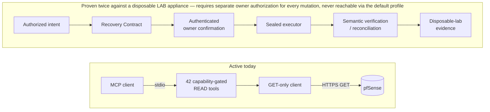

# pfsense-mcp-server

[](https://github.com/night4me/pfsense-mcp-server/actions/workflows/ci.yml)
[](https://github.com/night4me/pfsense-mcp-server/actions/workflows/codeql.yml)
[](https://pypi.org/project/pfsense-mcp-server/)

[](LICENSE)

**A security-first [MCP](https://modelcontextprotocol.io/) server for pfSense,
featuring cryptographically authorized, recoverable WRITE operations and
optional hardware-backed anti-rollback protection.**

MCP (Model Context Protocol) is the open standard AI assistants use to call
tools. This server implements it for pfSense: point an MCP client (Claude,
Codex, Cursor, and others) at it, and it gets strongly typed, read-only
visibility into one pfSense appliance — system, network, firewall, services,
users, certificates, and diagnostics — without exposing raw shell access, an
unaudited scripting surface, or a way to mutate the appliance by accident.

**Current production contract: 42 READ tools. 0 WRITE tools.**

That split is deliberate, not incomplete. See
[Why this project exists](#why-this-project-exists) below.

## Quick start

```console
python -m venv .venv
.venv/bin/python -m pip install --upgrade pip
.venv/bin/python -m pip install 'pfsense-mcp-server==0.3.0'
install -m 600 /dev/null /absolute/private/path/pfsense-api.key
# put the API key on the first line of that file, then:
```

```json
{
  "command": "/absolute/path/to/.venv/bin/pfsense-mcp-server",
  "env": {
    "PFSENSE_API_URL": "https://pfsense.example.invalid",
    "PFSENSE_IDENTITY": "api-mcp-admin",
    "PFSENSE_API_KEY_FILE": "/absolute/private/path/pfsense-api.key",
    "PFSENSE_TLS_MODE": "strict"
  }
}
```

Point your MCP client at that command (the exact configuration key varies by
client — see [verified client examples](examples/README.md)), confirm it
shows 42 READ tools and no WRITE tools, then try one of the
[example prompts](#example-prompts) below. Full configuration reference,
troubleshooting, and every environment variable:
[`docs/CONFIGURATION.md`](docs/CONFIGURATION.md).

`pfsense-mcp-server` is published on
[PyPI](https://pypi.org/project/pfsense-mcp-server/) with
[PEP 740](https://peps.python.org/pep-0740/) digital attestations verifiable
back to this repository and the exact release commit — no long-lived upload
token exists. To build from source instead, see
[`CONTRIBUTING.md`](CONTRIBUTING.md#local-setup).

## Example prompts

Ask your MCP client things like:

- *"Is my WAN gateway up, and what's the current latency and packet loss?"*
- *"Show me every active DHCP lease on the LAN."*
- *"What's the link status of each interface right now?"*
- *"What firewall rules apply to the WAN interface?"*
- *"Are all the services I've configured actually running?"*
- *"Which of my certificates expire in the next 30 days?"*
- *"Is CARP failover healthy across my HA pair?"*
- *"What DNS resolver overrides are configured, and do any look wrong?"*

Each maps to one typed, capability-gated tool — see the
[full tool reference](docs/API.md) for the complete 41-tool catalog.

## Why this project exists

I built this project because I wanted AI assistance for pfSense without
giving an LLM the ability to accidentally disconnect my own network.

A firewall is not just another application. It is the foundation
everything else depends on. Any software capable of changing firewall
rules, routing, interfaces, DNS, VPN configuration, or other
network-critical settings also has the ability to make that network
unreachable — and "the model probably won't make a bad change" is not a
safety mechanism, it's a hope. A mistaken tool invocation, a
misunderstood request, an implementation defect, or a weak authorization
boundary is all it takes. I believe those operations deserve a higher
safety standard than simply exposing WRITE tools to an AI model.

**This project deliberately started as READ-only.** Not because WRITE is
impossible. Not because WRITE is undesirable. Because I believe WRITE
should be earned through architecture rather than enabled by
implementation.

That's the core idea: **adding mutation code does not automatically
create production mutation capability.** The current production surface
is READ-only by construction, not by convention — enforced by a static
check over the transport layer, verified on every CI run, not a runtime
setting someone could accidentally flip. The v0.3.0 release already
ships a substantial WRITE-safety framework, and every part of it remains
structurally unreachable from the running server.

**What this means today:**

Current production:

- ✓ 42 READ tools
- ✓ 0 WRITE tools

**Update (2026-08-16):** every step below has now been exercised
end-to-end, twice, against a disposable, isolated LAB appliance —
never production or home pfSense — with independently-verified live
evidence (see `docs/adr/ADR-026-first-write-capability-adapter.md`).
The default production MCP contract above is still 0 WRITE tools: that
remains an explicit operator choice (profile selection), not an
architectural gap.

- explicit capability authorization — proven
- Recovery Contracts — proven
- authenticated confirmation — proven
- sealed execution — proven
- reconciliation — proven (offline, production-bound; no live fault
  ever occurred to exercise it against the real appliance)
- anti-rollback — proven (TPM witness genuinely advanced on both real
  writes, independently verified against the physical hardware)
- disposable-lab validation — proven
- explicit owner activation — required for every individual mutation,
  by design; still not something a default configuration or an AI
  session can trigger on its own



Every box in that second half exists as real, tested code and has now
been exercised against a real disposable LAB appliance — a canonical
Recovery Contract bound to the exact target and intent; a closed state
machine with crash-safe, atomic persistence; Ed25519-authenticated owner
confirmation and reconciliation; a sealed executor that is the *only*
component ever allowed to send one bounded mutating request and classify
what actually happened, rather than assume success. It has never touched
production or home pfSense, and it is not reachable under the default
profile shipped to every new installation — reaching it requires an
operator to explicitly select `PFSENSE_PROFILE=write_protected` and then
personally drive a real, owner-approved signing ceremony for each
individual mutation; nothing about it is automatic or AI-triggerable on
its own. See
[the Tier 1 architecture](docs/TIER1_ARCHITECTURE.md) and the
[public roadmap](docs/ROADMAP.md) for the complete picture, and
[the security model](docs/SECURITY_MODEL.md) for what's actually enforced,
not just designed.

**Different priorities.** Other pfSense MCP projects may prioritize
convenience, automation, or rapid feature development. This project
prioritizes minimizing the chance that an AI-assisted action could
unintentionally disrupt critical network infrastructure. Those are
different engineering priorities, not necessarily right or wrong ones.

I don't mind if an AI answers a question incorrectly. I do mind if an AI
accidentally disconnects my house from the Internet. That single design
principle explains almost every architectural decision in this
repository.

## Security

- Credential fields (API keys, passwords, private keys) never appear in a
  public model, MCP schema, log line, or exception message — by
  construction, not filtering.
- Fail-closed configuration and strict TLS by default.
- Explicit capability gates: an MCP tool is reachable only if its capability
  is in the selected profile's accepted set.
- The supported transport is local stdio; the process controlling that
  channel is the trust boundary — see
  [the threat model](docs/THREAT_MODEL.md) for exactly what that does and
  does not cover.

Every claim above is backed by a specific test class, listed with the tests
that enforce it in [`SECURITY.md`](SECURITY.md#security-guarantees). Report
vulnerabilities privately through [`SECURITY.md`](SECURITY.md) — never in a
public issue.

## Security-first by design

pfSense MCP Server is built around a deliberately conservative security
model: **READ by default, cryptographically controlled WRITE by explicit
authorization.** State-changing operations are protected by a
transaction-oriented security architecture designed for AI-initiated
infrastructure changes — not simply an API credential placed behind an
MCP tool.

The security model assumes that an AI agent requesting a mutation is not,
by itself, sufficient authority to perform it. The goal is not to make
AI-generated infrastructure changes merely possible — it is to make them
constrained, attributable, recoverable, and independently verifiable.

### Protected WRITE architecture

- Zero WRITE capabilities exposed by default — reaching the one accepted
  WRITE tool requires an operator to explicitly select
  `PFSENSE_PROFILE=write_protected`.
- Least-privilege pfSense credentials, scoped to exactly the REST
  endpoints the WRITE path needs — never a broad/administrative account.
- Explicit capability/security-posture gates, independent of and
  additional to profile selection.
- Deterministic plan and execution-intent binding — the exact target
  state is bound cryptographically before anything is authorized.
- Ed25519-signed authorization, produced off-host by a human operator.
- Short-lived, single-use authorization — consumed exactly once,
  independently of confirmation.
- Fresh-state revalidation before execution, with stale-state and
  concurrent-change refusal.
- A `RecoveryContract` state machine governing every mutation's full
  lifecycle, durable and auditable.
- Independently signed confirmation, using a separate confirmation
  authority from the authorization signer.
- Deterministic execution with authoritative read-back verification
  after every mutation.
- Fail-closed reconciliation on any ambiguous outcome — never a blind
  retry.
- Integrity-protected audit trail and state, MAC-authenticated
  end-to-end.
- Optional hardware-backed TPM monotonic witness for anti-rollback
  protection.

**`verified=True` does not mean WRITE is enabled by default.**
Verification, profile/posture selection, authorization, confirmation,
freshness, target state, and execution are separate, independently
enforced gates — every one of them must hold for a given mutation, every
time.

The protected WRITE path has been exercised end-to-end against a real
LAB pfSense appliance — never the owner's production/home pfSense —
including least-privilege execution, authoritative read-back,
`RecoveryContract` lifecycle, and TPM witness advancement. See
[`docs/adr/ADR-026-first-write-capability-adapter.md`](docs/adr/ADR-026-first-write-capability-adapter.md)
for the complete evidence chain.

## Documentation

A browsable version of the full documentation set below is published at
[night4me.github.io/pfsense-mcp-server](https://night4me.github.io/pfsense-mcp-server/)
(built with `make docs-serve` for a local preview); see
[`docs/index.md`](docs/index.md) for the same map.

- [MCP tool reference](docs/API.md)
- [Configuration reference](docs/CONFIGURATION.md)
- [Client setup examples](examples/README.md)
- [Security model](docs/SECURITY_MODEL.md) · [Threat model](docs/THREAT_MODEL.md)
- [Architecture diagrams](docs/ARCHITECTURE_DIAGRAMS.md) · [Architecture decisions](docs/adr/README.md)
- [Tier 1 safety architecture](docs/TIER1_ARCHITECTURE.md) · [Public roadmap](docs/ROADMAP.md)
- [Contributing](CONTRIBUTING.md) · [Support](SUPPORT.md) · [Security policy](SECURITY.md)

## Status

**v0.3.0 is the immutable production baseline, published on PyPI** — the
last release that completed a real PyPI upload. v0.4.1 is prepared,
release-candidate quality, and not yet published; this paragraph will be
updated to declare it the new baseline only at the moment the owner
actually completes that publication.

v0.4.1's only functional change from v0.3.0 is documentary/status, not
new tool surface: the public MCP contract is unchanged (still 42 READ
tools by default); the one WRITE capability this repository has ever
added (`set_firewall_alias_description_v1`) is now `verified=True`
following independently-verified live evidence (`ADR-026`), but remains
unreachable under the default profile, requires an operator to
explicitly opt into `write_protected`, and still requires a real,
owner-driven signing ceremony for every individual mutation — see [the
security model](docs/SECURITY_MODEL.md)'s "Recovery and WRITE status"
section for the precise, current description. The Tier 1 safety
framework described above remains implemented, tested, structurally
isolated code.

`v0.4.0` was tagged and its GitHub Release published, but PyPI
publication itself failed before any upload was attempted (a build-tool
metadata-version incompatibility, fixed in v0.4.1 — see `CHANGELOG.md`);
per this project's own release policy, that tag/Release is preserved
unmoved as an accurate historical record, and the fix ships as a new
version rather than editing it. Separately, `v0.3.1` was prepared
(version bumped, changelog entry written) but its tag/Release/PyPI
publish were never actually carried out — an inaccuracy that had stood
in this file since 2026-08-09, corrected here; see `CHANGELOG.md`'s
`[0.4.1]` entry for the full, read-only-investigated finding. See
[`docs/ROADMAP.md`](docs/ROADMAP.md) for what's next.

## Contributing

Contributions are welcome within the documented security and approval
boundaries. Read [CONTRIBUTING.md](CONTRIBUTING.md) before opening a change.

## License

Licensed under the [MIT License](LICENSE).
