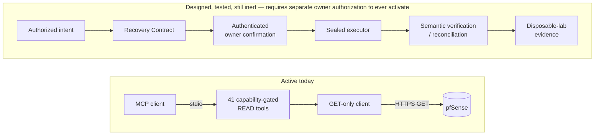

# pfsense-mcp-server

[](https://github.com/night4me/pfsense-mcp-server/actions/workflows/ci.yml)
[](https://github.com/night4me/pfsense-mcp-server/actions/workflows/codeql.yml)
[](https://pypi.org/project/pfsense-mcp-server/)

[](LICENSE)

**A security-first [MCP](https://modelcontextprotocol.io/) server for pfSense.**

MCP (Model Context Protocol) is the open standard AI assistants use to call
tools. This server implements it for pfSense: point an MCP client (Claude,
Codex, Cursor, and others) at it, and it gets strongly typed, read-only
visibility into one pfSense appliance — system, network, firewall, services,
users, certificates, and diagnostics — without exposing raw shell access, an
unaudited scripting surface, or a way to mutate the appliance by accident.

**Current production contract: 41 READ tools. 0 WRITE tools.**

That split is deliberate, not incomplete. See
[Why this project exists](#why-this-project-exists) below.

## Quick start

```console
python -m venv .venv
.venv/bin/python -m pip install --upgrade pip
.venv/bin/python -m pip install 'pfsense-mcp-server==0.3.0'
install -m 600 /dev/null /absolute/private/path/pfsense-api.key
# put the API key on the first line of that file, then:
```

```json
{
  "command": "/absolute/path/to/.venv/bin/pfsense-mcp-server",
  "env": {
    "PFSENSE_API_URL": "https://pfsense.example.invalid",
    "PFSENSE_IDENTITY": "api-mcp-admin",
    "PFSENSE_API_KEY_FILE": "/absolute/private/path/pfsense-api.key",
    "PFSENSE_TLS_MODE": "strict"
  }
}
```

Point your MCP client at that command (the exact configuration key varies by
client — see [verified client examples](examples/README.md)), confirm it
shows 41 READ tools and no WRITE tools, then try one of the
[example prompts](#example-prompts) below. Full configuration reference,
troubleshooting, and every environment variable:
[`docs/CONFIGURATION.md`](docs/CONFIGURATION.md).

`pfsense-mcp-server` is published on
[PyPI](https://pypi.org/project/pfsense-mcp-server/) with
[PEP 740](https://peps.python.org/pep-0740/) digital attestations verifiable
back to this repository and the exact release commit — no long-lived upload
token exists. To build from source instead, see
[`CONTRIBUTING.md`](CONTRIBUTING.md#local-setup).

## Example prompts

Ask your MCP client things like:

- *"Is my WAN gateway up, and what's the current latency and packet loss?"*
- *"Show me every active DHCP lease on the LAN."*
- *"What's the link status of each interface right now?"*
- *"What firewall rules apply to the WAN interface?"*
- *"Are all the services I've configured actually running?"*
- *"Which of my certificates expire in the next 30 days?"*
- *"Is CARP failover healthy across my HA pair?"*
- *"What DNS resolver overrides are configured, and do any look wrong?"*

Each maps to one typed, capability-gated tool — see the
[full tool reference](docs/API.md) for the complete 41-tool catalog.

## Why this project exists

I built this project because I wanted AI assistance for pfSense without
giving an LLM the ability to accidentally disconnect my own network.

A firewall is not just another application. It is the foundation
everything else depends on. Any software capable of changing firewall
rules, routing, interfaces, DNS, VPN configuration, or other
network-critical settings also has the ability to make that network
unreachable — and "the model probably won't make a bad change" is not a
safety mechanism, it's a hope. A mistaken tool invocation, a
misunderstood request, an implementation defect, or a weak authorization
boundary is all it takes. I believe those operations deserve a higher
safety standard than simply exposing WRITE tools to an AI model.

**This project deliberately started as READ-only.** Not because WRITE is
impossible. Not because WRITE is undesirable. Because I believe WRITE
should be earned through architecture rather than enabled by
implementation.

That's the core idea: **adding mutation code does not automatically
create production mutation capability.** The current production surface
is READ-only by construction, not by convention — enforced by a static
check over the transport layer, verified on every CI run, not a runtime
setting someone could accidentally flip. The v0.3.0 development tree
already contains a substantial WRITE-safety framework, and every part of
it remains structurally unreachable from the running server.

**What this means today:**

Current production:

- ✓ 41 READ tools
- ✓ 0 WRITE tools

Future WRITE requires, in order, before any of it can ever activate:

- explicit capability authorization
- Recovery Contracts
- authenticated confirmation
- sealed execution
- reconciliation
- anti-rollback
- disposable-lab validation
- explicit owner activation



Every box in the "designed, tested, still inert" half already exists as
real, tested code — a canonical Recovery Contract bound to the exact target
and intent; a closed state machine with crash-safe, atomic persistence;
Ed25519-authenticated owner confirmation and reconciliation; a sealed
executor that is the *only* component ever allowed to send one bounded
mutating request and classify what actually happened, rather than assume
success; and an offline-tested fault-injection harness for disposable-lab
validation before any of it ever touches a real appliance. None of it is
reachable today. See
[the Tier 1 architecture](docs/TIER1_ARCHITECTURE.md) and the
[public roadmap](docs/ROADMAP.md) for the complete picture, and
[the security model](docs/SECURITY_MODEL.md) for what's actually enforced,
not just designed.

**Different priorities.** Other pfSense MCP projects may prioritize
convenience, automation, or rapid feature development. This project
prioritizes minimizing the chance that an AI-assisted action could
unintentionally disrupt critical network infrastructure. Those are
different engineering priorities, not necessarily right or wrong ones.

I don't mind if an AI answers a question incorrectly. I do mind if an AI
accidentally disconnects my house from the Internet. That single design
principle explains almost every architectural decision in this
repository.

## Security

- Credential fields (API keys, passwords, private keys) never appear in a
  public model, MCP schema, log line, or exception message — by
  construction, not filtering.
- Fail-closed configuration and strict TLS by default.
- Explicit capability gates: an MCP tool is reachable only if its capability
  is in the selected profile's accepted set.
- The supported transport is local stdio; the process controlling that
  channel is the trust boundary — see
  [the threat model](docs/THREAT_MODEL.md) for exactly what that does and
  does not cover.

Every claim above is backed by a specific test class, listed with the tests
that enforce it in [`SECURITY.md`](SECURITY.md#security-guarantees). Report
vulnerabilities privately through [`SECURITY.md`](SECURITY.md) — never in a
public issue.

## Documentation

A browsable version of the full documentation set below is published at
[night4me.github.io/pfsense-mcp-server](https://night4me.github.io/pfsense-mcp-server/)
(built with `make docs-serve` for a local preview); see
[`docs/index.md`](docs/index.md) for the same map.

- [MCP tool reference](docs/API.md)
- [Configuration reference](docs/CONFIGURATION.md)
- [Client setup examples](examples/README.md)
- [Security model](docs/SECURITY_MODEL.md) · [Threat model](docs/THREAT_MODEL.md)
- [Architecture diagrams](docs/ARCHITECTURE_DIAGRAMS.md) · [Architecture decisions](docs/adr/README.md)
- [Tier 1 safety architecture](docs/TIER1_ARCHITECTURE.md) · [Public roadmap](docs/ROADMAP.md)
- [Contributing](CONTRIBUTING.md) · [Support](SUPPORT.md) · [Security policy](SECURITY.md)

## Status

v0.3.0 is the immutable production baseline, published on PyPI. It ships
the Tier 1 safety framework described above as implemented, tested,
structurally isolated code — no mutating capability, endpoint, transport
path, or MCP tool is active as part of it. v0.2.2 remains the prior
published release. See [`docs/ROADMAP.md`](docs/ROADMAP.md) for what's
next.

## Contributing

Contributions are welcome within the documented security and approval
boundaries. Read [CONTRIBUTING.md](CONTRIBUTING.md) before opening a change.

## License

Licensed under the [MIT License](LICENSE).
