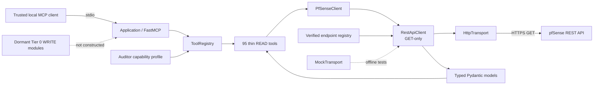
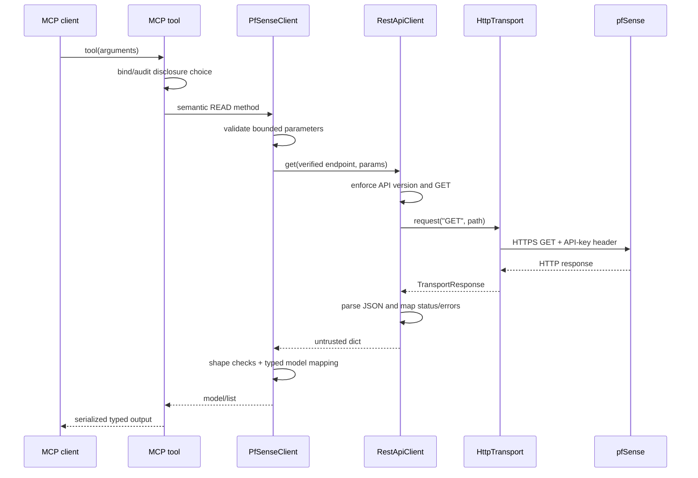
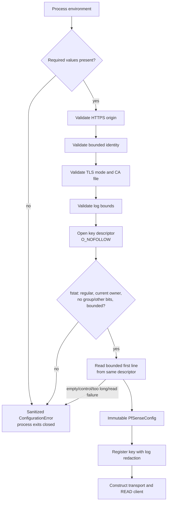
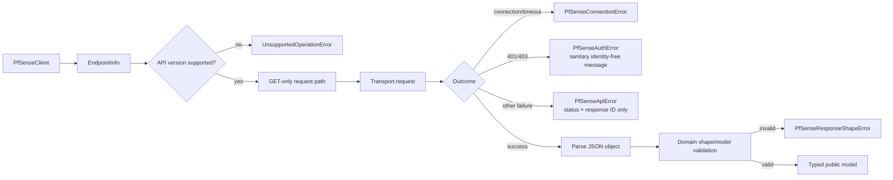
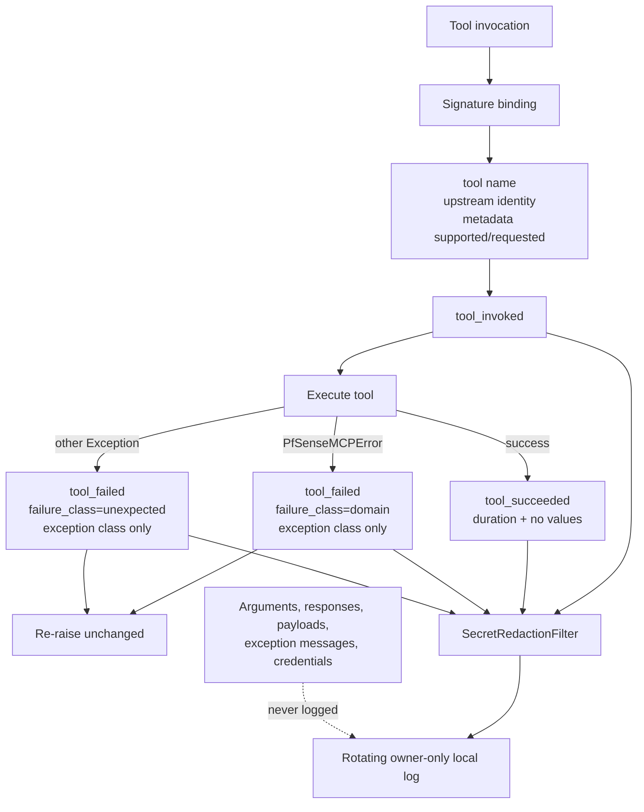
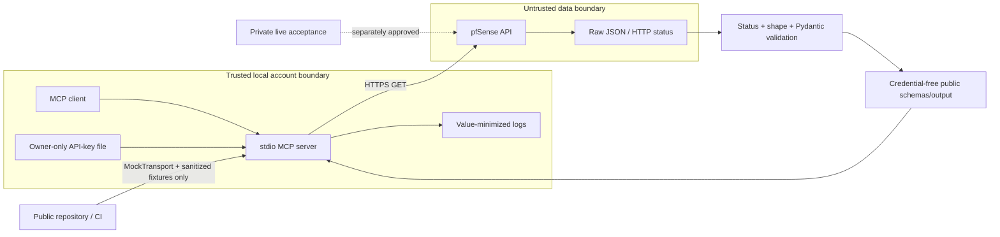
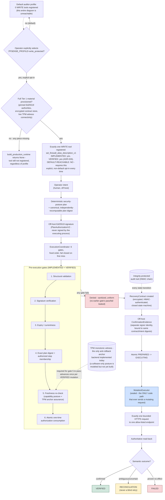
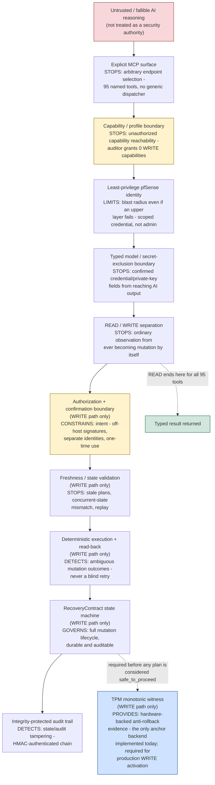

# Architecture diagrams

These diagrams describe the current release's production READ path (95
tools, 0 default WRITE) and the protected WRITE architecture built and
independently verified per `ADR-026`. Solid paths are active in
production; not-default-reachable paths are explicitly labeled as such
rather than as "future" or "inert" — the WRITE architecture is real,
implemented, and live-verified code, just never reachable without an
explicit, separate operator opt-in.

## Overall architecture

## READ request flow

## MCP tool registration

## Configuration loading

## REST client and error boundary

## Audit logging

## Security boundaries

## READ security path (summary)

Source: `src/pfsense_mcp/tools/registry.py`, `capabilities.py`, `profiles.py`,
`pfsense_client.py`. Every one of the 95 registered READ tools takes this
exact path — no exceptions.

```mermaid
flowchart LR
    A["AI / MCP client"] -->|"stdio (trust boundary)"| B["Explicit registered<br/>MCP tool<br/>(1 of 95, no dispatcher)"]
    B --> C["Capability / profile gate<br/>(auditor: READ only)"]
    C --> D["Least-privilege mapping<br/>(exact pfSense privilege)"]
    D --> E["One fixed typed<br/>client method"]
    E --> F["pfREST GET<br/>(GET-only, enforced)"]
    F --> G[("pfSense appliance")]
    G --> H["Typed model boundary<br/>(secret fields excluded<br/>by construction)"]
    H --> I["Safe MCP result"]

    style A fill:#eee,stroke:#333
    style G fill:#eee,stroke:#333
    style C fill:#fff3cd,stroke:#856404
    style D fill:#fff3cd,stroke:#856404
    style H fill:#d1e7dd,stroke:#0f5132
```

Yellow boxes are hard, fail-closed gates (a capability not in the active
profile is never registered at all — not merely hidden). The green box is
where confirmed secret-bearing fields are structurally excluded from the
Pydantic model, not filtered post hoc. See "READ request flow" above for
the full call-by-call sequence this summarizes.

## Protected WRITE authorization path (`ADR-026`)

Source: `src/pfsense_mcp/tier1/execution_coordinator.py`,
`alias_description_execution.py`, `executor.py`, `state_machine.py`,
`SECURITY_MODEL.md`, and
[`ADR-026`](adr/ADR-026-first-write-capability-adapter.md) (accepted,
live-verified evidence). This describes the one capability that exists
today, `set_firewall_alias_description_v1` — not a general WRITE
framework covering arbitrary mutations.

**Implemented, verified, and default-reachable are three different
claims.** This path is real, committed code (`IMPLEMENTED`), exercised
end-to-end twice against a real disposable LAB appliance with
independent verification each time, never production (`VERIFIED`), and
requires an explicit non-default profile opt-in plus a full Tier 1
material provisioning step before the one tool is even registered
(`NOT DEFAULT-REACHABLE`). None of the six pre-execution gates, the
`RecoveryContract` state machine, or the sealed executor are
hypothetical — but none of them are reachable by an AI model deciding,
on its own, to call a tool. The off-host Ed25519 signature step is the
concrete reason why: the running MCP server process never holds a
private key capable of producing a valid `PlanAuthorizationV2` or
`ConfirmationEvidence`, by construction.

## Defense in depth / trust boundaries

This is the high-level model: where each class of failure is actually
stopped, derived from the same source as the two diagrams above. Verbs
are deliberately specific (`STOPS`/`LIMITS`/`CONSTRAINS`/`DETECTS`/`PROVIDES`)
rather than a blanket "secure" — a defense-in-depth layer is not an
absolute guarantee, and this diagram does not claim otherwise.

Layers L1–L5 apply to every request, READ or WRITE. Layers L6–L11 exist
only on the WRITE path and are unreachable under the default profile —
see the authorization-path diagram above for how an AI model is kept
out of that path entirely, not merely discouraged from using it.
