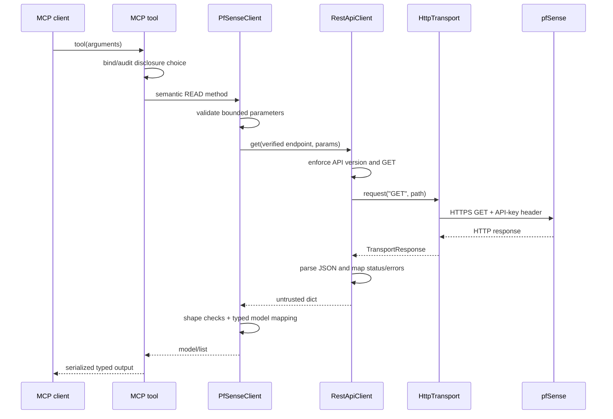
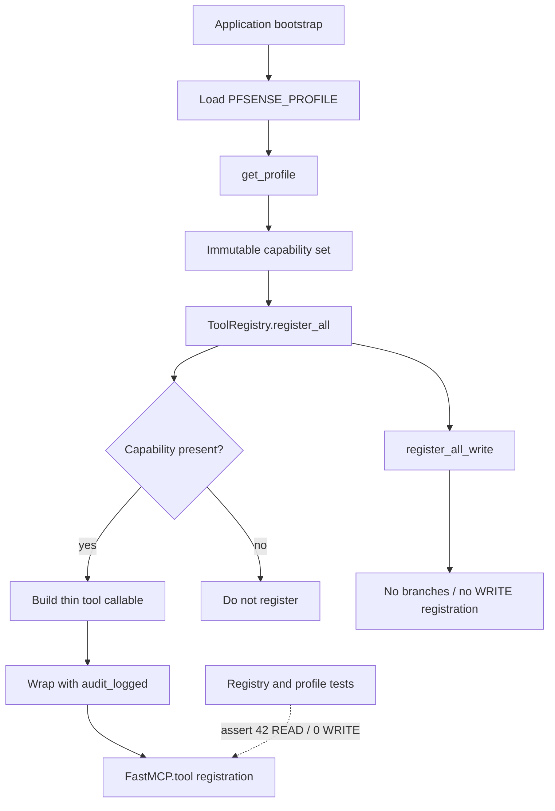
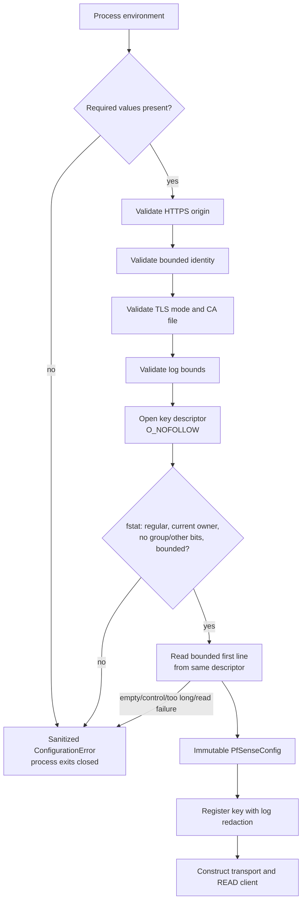
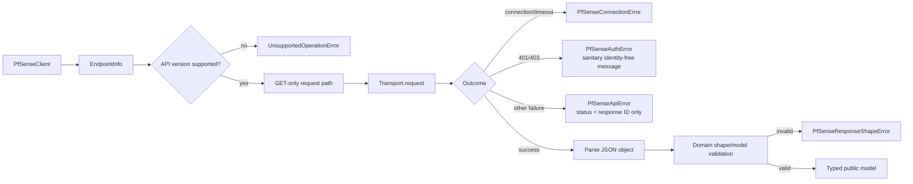
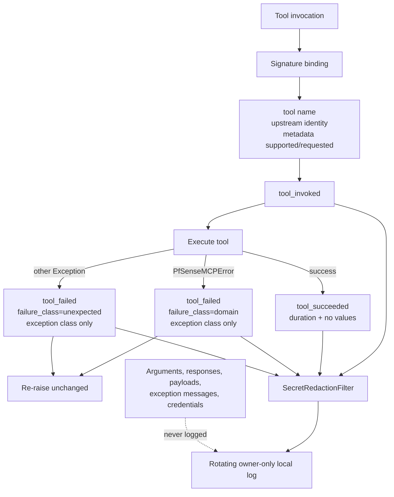
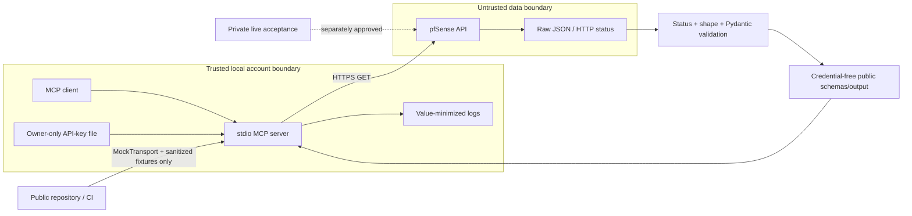
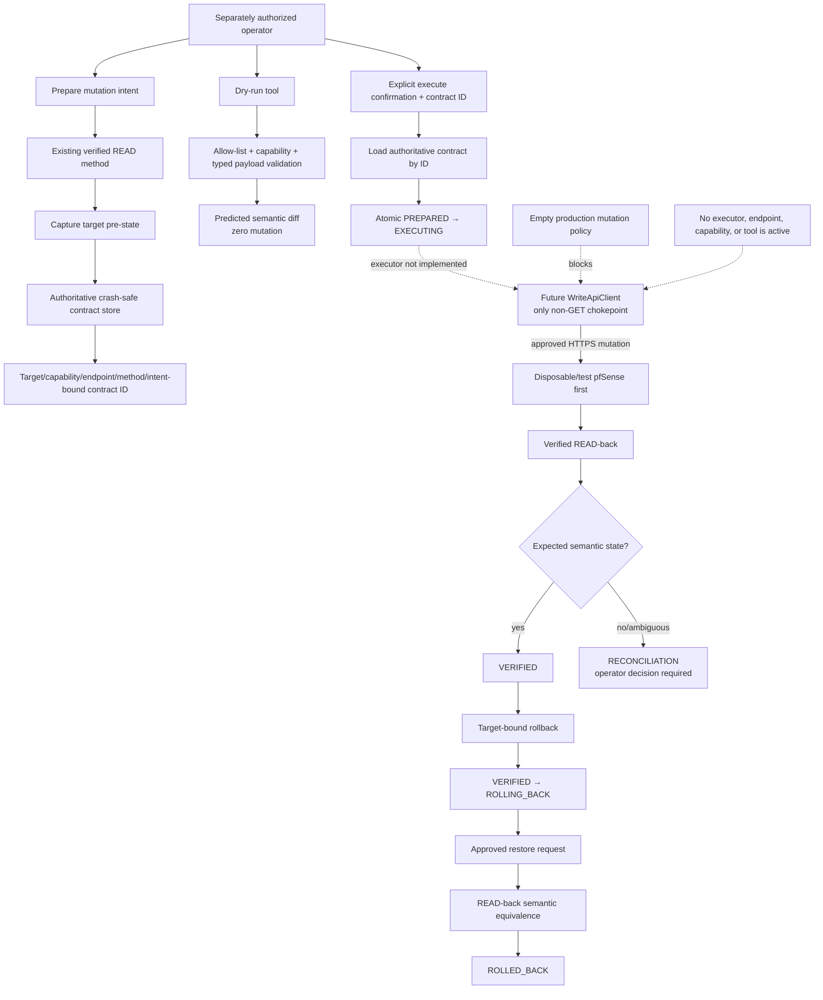

# Architecture diagrams

These diagrams describe the immutable v0.3.0 production baseline (same
active READ path as v0.2.2) and the inert Tier 1 development framework it
ships. Solid paths are active in production; future/dormant paths are
explicitly labeled.

## Overall architecture

## READ request flow

## MCP tool registration

## Configuration loading

## REST client and error boundary

## Audit logging

## Security boundaries

## Inert Tier 1 framework and future execution path

The contract, state-machine, policy, audit, and authenticated-store boxes exist
only as isolated domain infrastructure. The dotted execution path requires
every remaining milestone in [the Tier 1 roadmap](TIER1_ROADMAP.md) and
separate capability-specific authorization before any WRITE endpoint or tool
is added.
